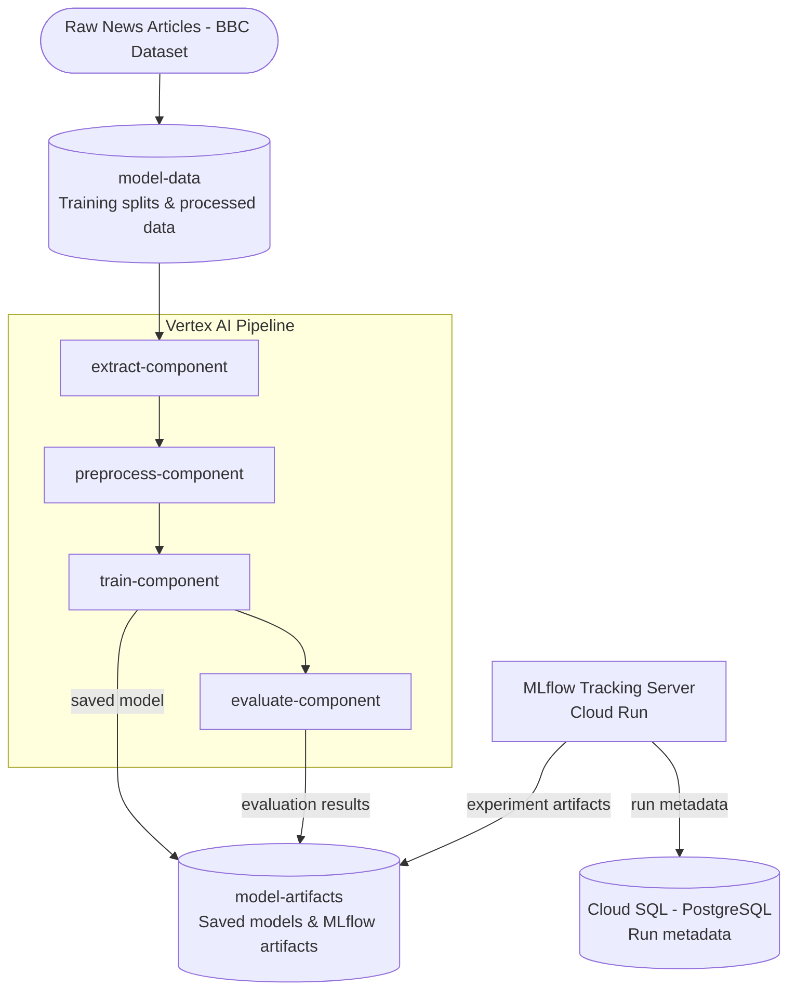

# News Topic Classifier — Infrastructure

Terraform infrastructure for the News Topic Classifier pipeline, deployed across three GCP environments (dev, pre-prod, production).

## Repository Structure

```
.
├── bootstrap/          # One-time bootstrap: WIF, GitHub SA, state buckets
├── docker/
│   └── mlflow/         # Dockerfile for MLflow tracking server
├── environments/
│   ├── dev/            # Development environment
│   ├── pp/             # Pre-production environment
│   └── prd/            # Production environment
└── modules/
    ├── artifact_registry/
    ├── bigquery/
    ├── cloud_run/       # MLflow tracking server (Cloud Run + IAM)
    ├── cloud_sql/       # MLflow backend store (PostgreSQL)
    ├── cloud_storage/
    ├── secret_manager/
    └── vertex_ai/
```

## GCP Projects

| Environment  | Project ID              |
|-------------|--------------------------|
| Development  | `cs-cdwp-data-dev2188`  |
| Pre-Prod     | `cs-cdwp-data-pp2188`   |
| Production   | `cs-cdwp-data-prd2188`  |

---

## Architecture

```
Vertex AI Pipeline
       │
       ▼ logs metrics
MLflow Tracking Server (Cloud Run)
       │                    │
       ▼                    ▼
Cloud SQL (PostgreSQL)    GCS (artifacts)
  run metadata             model files
```

---

## Deployment Order

```
Bootstrap  ──────────────────────────────────────────────────────────►  creates Artifact Registry repos
                                                                                      │
                                                                                      ▼
                                                                         Push MLflow Docker image
                                                                         (image must exist in registry)
                                                                                      │
                                                                                      ▼
                                                                         terraform apply (all envs)
                                                                         Cloud Run pulls image from registry
```

**Why this exact order matters:**
- Bootstrap creates the Artifact Registry repos — you can't push an image before they exist
- The MLflow image must be in the registry before `terraform apply` — Cloud Run will fail to deploy if the image is missing
- Environment apply wires everything together (Cloud Run, Cloud SQL, IAM, GCS) using the image and repos created above

---

### 1. Bootstrap (one-time)
```bash
make apply-bootstrap
```
Creates the GitHub Actions SA, Workload Identity Federation, Terraform state buckets, Artifact Registry repos, and enables all required APIs across all three projects.

### 2. Build and push the MLflow Docker image
```bash
make mlflow-auth        # configure Docker to push to Artifact Registry
make mlflow-push-all    # build once, push to dev / pp / prd registries
```
Builds `docker/mlflow/Dockerfile` (MLflow + psycopg2 + GCS support) and pushes to each project's Artifact Registry. Must happen after bootstrap so the repos exist.

### 3. Apply environments in order
```bash
make init-all

make plan-dev && make apply-dev
make plan-pp  && make apply-pp
make plan-prd && make apply-prd
```
Creates Cloud SQL, Cloud Run (MLflow), GCS buckets, BigQuery, Secret Manager secrets, and all IAM bindings. Cloud Run pulls the MLflow image pushed in step 2.

Get the MLflow URL for each environment after apply:
```bash
cd environments/dev && terraform output mlflow_tracking_url
cd environments/pp  && terraform output mlflow_tracking_url
cd environments/prd && terraform output mlflow_tracking_url
```

---

## GCP Resources

### CI/CD — Bootstrap (one-time, dev project only)

| Resource Type | Name / ID |
|---|---|
| Service Account | `github-actions-sa@cs-cdwp-data-dev2188.iam.gserviceaccount.com` |
| Workload Identity Pool | `github-pool` (project `cs-cdwp-data-dev2188`) |
| Workload Identity Provider | `github-provider` (issuer: `token.actions.githubusercontent.com`) |

**Workload Identity Provider full resource name:**
```
projects/74788655295/locations/global/workloadIdentityPools/github-pool/providers/github-provider
```

### Terraform State Buckets (one per project)

| Environment | Bucket Name |
|---|---|
| Development  | `cs-cdwp-data-dev2188-terraform-state` |
| Pre-Prod     | `cs-cdwp-data-pp2188-terraform-state`  |
| Production   | `cs-cdwp-data-prd2188-terraform-state` |

> Versioning enabled, uniform bucket-level access, location: US.

### Artifact Registry

| Environment | Repository | Location | Format |
|---|---|---|---|
| Development  | `news-topic-classifier` | `us-central1` | Docker |
| Pre-Prod     | `news-topic-classifier` | `us-central1` | Docker |
| Production   | `news-topic-classifier` | `us-central1` | Docker |

### Cloud Storage Buckets

| Environment | Purpose | Bucket Name |
|---|---|---|
| Development  | Model Artifacts | `cs-cdwp-data-dev2188-model-artifacts` |
| Development  | Training Data   | `cs-cdwp-data-dev2188-model-data`      |
| Pre-Prod     | Model Artifacts | `cs-cdwp-data-pp2188-model-artifacts`  |
| Pre-Prod     | Training Data   | `cs-cdwp-data-pp2188-model-data`       |
| Production   | Model Artifacts | `cs-cdwp-data-prd2188-model-artifacts` |
| Production   | Training Data   | `cs-cdwp-data-prd2188-model-data`      |

> Versioning enabled, uniform bucket-level access, location: US.

### BigQuery Datasets

| Environment | Dataset ID |
|---|---|
| Development  | `DATA_SCNCE_DEV_DATA` |
| Pre-Prod     | `DATA_SCNCE_DEV_DATA` |
| Production   | `DATA_SCNCE_DATA`     |

### Secret Manager

| Environment | Secret ID | Description |
|---|---|---|
| Development  | `huggingface-token`  | HuggingFace API token for Vertex AI |
| Pre-Prod     | `huggingface-token`  | HuggingFace API token for Vertex AI |
| Production   | `huggingface-token`  | HuggingFace API token for Vertex AI |
| Development  | `mlflow-db-password` | MLflow PostgreSQL user password |
| Pre-Prod     | `mlflow-db-password` | MLflow PostgreSQL user password |
| Production   | `mlflow-db-password` | MLflow PostgreSQL user password |

### Service Accounts

| SA | Environment | Email |
|---|---|---|
| Vertex AI | dev | `vertex-ai-sa@cs-cdwp-data-dev2188.iam.gserviceaccount.com` |
| Vertex AI | pp  | `vertex-ai-sa@cs-cdwp-data-pp2188.iam.gserviceaccount.com`  |
| Vertex AI | prd | `vertex-ai-sa@cs-cdwp-data-prd2188.iam.gserviceaccount.com` |
| MLflow    | dev | `mlflow-sa@cs-cdwp-data-dev2188.iam.gserviceaccount.com`    |
| MLflow    | pp  | `mlflow-sa@cs-cdwp-data-pp2188.iam.gserviceaccount.com`     |
| MLflow    | prd | `mlflow-sa@cs-cdwp-data-prd2188.iam.gserviceaccount.com`    |

**Vertex AI SA roles:**
- `roles/aiplatform.user`
- `roles/bigquery.dataEditor`
- `roles/bigquery.jobUser`
- `roles/storage.objectAdmin`
- `roles/artifactregistry.reader`
- `roles/run.invoker` on `mlflow-tracking-server`

**MLflow SA roles:**
- `roles/cloudsql.client`
- `roles/storage.objectAdmin`
- `roles/secretmanager.secretAccessor` on `mlflow-db-password`

### MLflow Tracking Server

| Resource | Details |
|---|---|
| Cloud Run service | `mlflow-tracking-server` (`us-central1`) |
| Cloud SQL instance | `{project_id}-mlflow` — PostgreSQL 15 |
| Database / User | `mlflow` / `mlflow` |
| DB password secret | `mlflow-db-password` (Secret Manager) |
| Artifact root | `gs://{project_id}-model-artifacts/mlflow-artifacts` |

**Database tiers per environment:**

| Environment | Tier | RAM | Deletion protection |
|---|---|---|---|
| dev | `db-f1-micro`      | 0.6 GB | false |
| pp  | `db-g1-small`      | 1.7 GB | false |
| prd | `db-custom-2-7680` | 7.5 GB | true  |

### Enabled APIs (all three projects)

| API |
|---|
| `iam.googleapis.com` |
| `cloudresourcemanager.googleapis.com` |
| `iamcredentials.googleapis.com` |
| `sts.googleapis.com` |
| `bigquery.googleapis.com` |
| `storage.googleapis.com` |
| `artifactregistry.googleapis.com` |
| `aiplatform.googleapis.com` |
| `run.googleapis.com` |
| `cloudscheduler.googleapis.com` |
| `secretmanager.googleapis.com` |
| `sqladmin.googleapis.com` |

---

## MLflow Docker Image

The MLflow image is built from `docker/mlflow/Dockerfile` and includes:
- `mlflow[gcs]` — MLflow with Google Cloud Storage artifact support
- `psycopg2-binary` — PostgreSQL driver for the Cloud SQL backend store

**Makefile commands:**

| Command | Description |
|---|---|
| `make mlflow-auth` | Authenticate Docker to Artifact Registry |
| `make mlflow-build` | Build the image locally |
| `make mlflow-push-dev` | Build and push to dev registry |
| `make mlflow-push-pp` | Tag and push to pp registry |
| `make mlflow-push-prd` | Tag and push to prd registry |
| `make mlflow-push-all` | Push to all three registries |

To upgrade MLflow, edit the version pin in `docker/mlflow/Dockerfile` and re-run `make mlflow-push-all`.

---

## Data & Artifact Storage Flow



> Diagram links open the **dev** bucket. Use the table below to navigate per environment.

### Bucket Directory

| Environment | Purpose | Bucket | GCP Console |
|---|---|---|---|
| dev | Training Data   | `cs-cdwp-data-dev2188-model-data`      | [open ↗](https://console.cloud.google.com/storage/browser/cs-cdwp-data-dev2188-model-data) |
| dev | Model Artifacts | `cs-cdwp-data-dev2188-model-artifacts` | [open ↗](https://console.cloud.google.com/storage/browser/cs-cdwp-data-dev2188-model-artifacts) |
| pp  | Training Data   | `cs-cdwp-data-pp2188-model-data`       | [open ↗](https://console.cloud.google.com/storage/browser/cs-cdwp-data-pp2188-model-data) |
| pp  | Model Artifacts | `cs-cdwp-data-pp2188-model-artifacts`  | [open ↗](https://console.cloud.google.com/storage/browser/cs-cdwp-data-pp2188-model-artifacts) |
| prd | Training Data   | `cs-cdwp-data-prd2188-model-data`      | [open ↗](https://console.cloud.google.com/storage/browser/cs-cdwp-data-prd2188-model-data) |
| prd | Model Artifacts | `cs-cdwp-data-prd2188-model-artifacts` | [open ↗](https://console.cloud.google.com/storage/browser/cs-cdwp-data-prd2188-model-artifacts) |

MLflow artifacts are stored under `gs://{project_id}-model-artifacts/mlflow-artifacts/`.

---

## MLflow Tracking URLs

Retrieved after each environment's `terraform apply` via `terraform output mlflow_tracking_url`.

| Environment | Project | MLflow Tracking URL |
|---|---|---|
| dev | `cs-cdwp-data-dev2188` | `https://mlflow-tracking-server-eeh43tst7q-uc.a.run.app` |
| pp  | `cs-cdwp-data-pp2188`  | `https://mlflow-tracking-server-nityigrfzq-uc.a.run.app` |
| prd | `cs-cdwp-data-prd2188` | `https://mlflow-tracking-server-wngg5g6m6q-uc.a.run.app` |

> URLs contain a GCP-assigned hash and are permanent for the lifetime of the Cloud Run service. Update this table after each environment is first applied.

---

## Using MLflow from a Vertex AI Pipeline

The Cloud Run service requires IAM authentication. Use a GCP ID token via the `MLFLOW_TRACKING_TOKEN` environment variable, which MLflow sends automatically as a `Bearer` header:

```python
import os
import mlflow
import google.auth
import google.auth.transport.requests
from google.auth.transport.requests import AuthorizedSession
from google.oauth2 import id_token

MLFLOW_URL = "<value of terraform output mlflow_tracking_url>"

auth_req = google.auth.transport.requests.Request()
token = id_token.fetch_id_token(auth_req, MLFLOW_URL)

os.environ["MLFLOW_TRACKING_TOKEN"] = token
mlflow.set_tracking_uri(MLFLOW_URL)
mlflow.set_experiment("news-topic-classifier")
```

The `vertex-ai-sa` already has `roles/run.invoker` so no additional IAM setup is needed in the pipeline.

---

## GitHub Actions Credentials

```
service_account_email =
"github-actions-sa@cs-cdwp-data-dev2188.iam.gserviceaccount.com"

workload_identity_provider =
"projects/74788655295/locations/global/workloadIdentityPools/github-pool/providers/github-provider"
```
